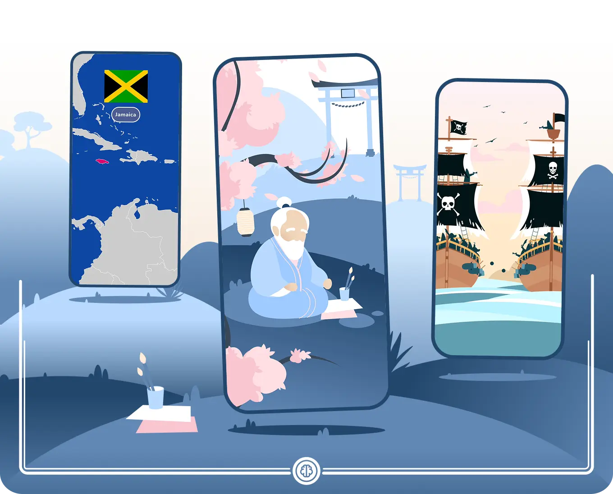

# Anecdotes Catalog

> This package is a companion to the [Anecdotes](https://github.com/Papi-Eruh/anecdotes) framework, born out of the development of the [Erudit](https://github.com/Papi-Eruh/erudit_public) application. We decided to make it open source so other developers can benefit from it.



## What is Anecdotes Catalog?

**Anecdotes Catalog** is a collection of pre-built, ready-to-use `Measure` and `MeasureWidget` components for the [Anecdotes](https://github.com/Papi-Eruh/anecdotes) storytelling package. It accelerates development by providing common scene types, allowing you to focus on your narrative.

### Key Features:

*   **Ready-to-Use Scenes**: Drop pre-built measures into your anecdotes without writing custom widget code.
*   **Rive Animations**: Easily integrate and control looping [Rive](https://rive.app/) animations as part of your story with `LoopingRiveMeasure`.
*   **Interactive World Maps**: Display a world map and highlight specific countries using the `WorldMapMeasure`.
*   **Extensible**: Use this package as a starting point and contribute your own reusable measures for the community.

### Built with

* [![Flutter][Flutter]][Flutter-url]
* [![Dart][Dart]][Dart-url]

## Getting started

### Prerequisites

Make sure you have the Flutter SDK (version >=3.35.0) and Dart SDK (version >=3.9.0) installed. You also need to have the base `anecdotes` package in your project.

### Installation

To use this package, add it as a git dependency in your `pubspec.yaml` file along with `anecdotes`. 
```yaml
dependencies:
  flutter:
    sdk: flutter
  anecdotes:
    git:
      url: https://github.com/Papi-Eruh/anecdotes.git
  anecdotes_catalog:
    git:
      url: https://github.com/Papi-Eruh/anecdotes_catalog.git
```

Then, run `flutter pub get` in your project's root directory.

## Usage

Using the catalog is straightforward. Once you have your `Anecdote` set up, you can use the measures from this package just like any other `Measure`. The key is to register the corresponding widgets from the catalog with your `MeasureBuilderRegistry`.

> A complete, ready-to-test version of this example is available in the `/example` directory of this project.

<br>

### 1. Register the Catalog Widgets

In your app's initialization, get an instance of `MeasureBuilderRegistry` and register the widgets you want to use from the catalog.

```dart
import 'package:anecdotes_catalog/anecdotes_catalog.dart';
import 'package:flutter/material.dart';

// ...

final _registry = MeasureBuilderRegistry();

@override
void initState() {
  _registry
    ..register<LoopingRiveMeasure>(
      (context, measure) => LoopingRiveMeasureWidget(measure: measure),
    )
    ..register<WorldMapMeasure>(
      (context, measure) => WorldMapMeasureWidget(
        measure: measure,
        languageCode: 'en', // Customize the map language
        countryWidgetBuilder: (cc, path) => SafeArea(
          child: Align(
            alignment: Alignment.topCenter,
            // Example of a custom widget to display on top of the map
            child: SvgPicture.asset(path, height: 100),
          ),
        ),
      ),
    );
  super.initState();
}
```

### 2. Use the Measures in an Anecdote

Now you can compose your `Anecdote` using the measures you just registered. Here, we create a story that first shows a Rive animation and then highlights Jamaica on a world map.

```dart
import 'package:anecdotes/anecdotes.dart';
import 'package:anecdotes_catalog/anecdotes_catalog.dart';
import 'package:maestro_just_audio/maestro_just_audio.dart';


// Define an anecdote that uses the catalog measures
final anecdote = MyAnecdote(
  measures: [
    LoopingRiveMeasure(
      riveSource: AssetSource('assets/animations/pirates.riv'),
      completionType: MeasureCompletionType.music,
    ),
    WorldMapMeasure(
      countryCode: 'JM',
      completionType: MeasureCompletionType.music,
    ),
  ],
  musicSource: PlaylistSource([
    AssetAudioSource('assets/audio/barco_aventura.mp3'),
    AssetAudioSource('assets/audio/barco_aventura.mp3'),
  ]),
);

// ...

// Pass the registry to the AnecdoteWidget
MaterialApp(
  home: AnecdoteWidget(
    anecdote: anecdote,
    measureBuilderRegistry: _registry,
    // ... other players and builders
  ),
);
```

And that's it! The `AnecdoteWidget` will now know how to render `LoopingRiveMeasure` and `WorldMapMeasure` when it encounters them in your story.

## Available Measures

This catalog currently includes:

-   **`LoopingRiveMeasure`**: Plays a Rive animation from a specified source (`riveSource`). The animation loops continuously until the measure is completed.
-   **`WorldMapMeasure`**: Displays a world map and visually highlights a country specified by its `countryCode`. It's highly customizable, allowing you to overlay custom widgets.

## Contributing

This catalog is just getting started, and we welcome contributions! If you have built a reusable `Measure` and `MeasureWidget` that could benefit the community, we encourage you to add it to the catalog.

### How to Contribute:

1.  **Fork the repository** on GitHub.
2.  **Create a new `Measure`**: Define your measure's data in `lib/src/models`. Follow the example of `LoopingRiveMeasure`.
3.  **Create the `MeasureWidget`**: Build the corresponding widget in `lib/src/widgets`. It must extend `MeasureBaseWidget` and `MeasureBaseState`. See the `anecdotes` package [README](https://github.com/Papi-Eruh/anecdotes#creating-a-custom-measure-widget) for a detailed guide.
4.  **Add an example**: Update the `example` app to showcase your new measure.
5.  **Submit a Pull Request**: We'll review your contribution and merge it.

By adding to the catalog, you help other developers tell amazing stories more easily.

### Top contributors:

<a href="https://github.com/Papi-Eruh/anecdotes_catalog/graphs/contributors">
  
</a>

## License

Distributed under the MIT License. See `./LICENSE` for more information.

## Contact

<contact@erudit.app>  
Project link: <https://erudit.app>

## Acknowledgments

* https://github.com/Papi-Eruh/anecdotes
* https://github.com/othneildrew/Best-README-Template
* https://cli.vgv.dev/


[Dart]: https://img.shields.io/badge/Dart-0175C2?style=for-the-badge&logo=dart&logoColor=white
[Dart-url]: https://dart.dev/
[Flutter]: https://img.shields.io/badge/Flutter-02569B?style=for-the-badge&logo=flutter&logoColor=white
[Flutter-url]: https://flutter.dev/
